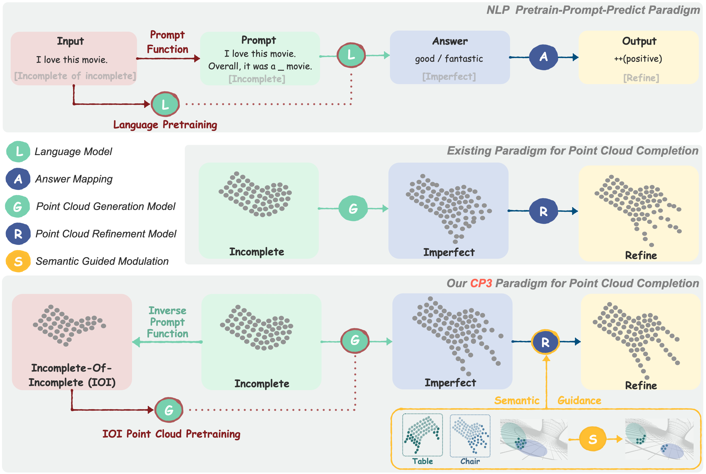

# * CP3: Unifying Point Cloud Completion by Pretrain-Prompt-Predict Paradigm
<p align="center"> 

</p>


This repository is built for the official implementation of:

__CP3__:  Unifying Point Cloud Completion by Pretrain-Prompt-Predict Paradigm ___(T-PAMI)___ [[paper](https://ieeexplore.ieee.org/abstract/document/10097548)],


## Introduction
Point cloud completion aims to predict complete shape from its partial observation. Current approaches mainly consist of generation and refinement stages in a coarse-to-fine style. However, the generation stage often lacks robustness to tackle different incomplete variations, while the refinement stage blindly recovers point clouds without the semantic awareness. 

To tackle these challenges, we unify point cloud Completion by a generic Pretrain-Prompt-Predict paradigm, namely CP3. Inspired by prompting approaches from NLP, we creatively reinterpret point cloud generation and refinement as the prompting and predicting stages, respectively. Then, we introduce a concise self-supervised pretraining stage before prompting. It can effectively increase robustness of
point cloud generation, by an Incompletion-Of-Incompletion (IOI) pretext task. Moreover, we develop a novel Semantic Conditional Refinement (SCR) network at the predicting stage. It can discriminatively modulate multi-scale refinement with the guidance of semantics. Finally, extensive experiments demonstrate that our CP3 outperforms the state-of-the-art methods with a large margin.


### MVP Completion Dataset
<!-- Download the MVP completion dataset by the following commands:
```
cd data; sh download_data.sh
``` -->
Download the MVP completion dataset(https://www.dropbox.com/sh/la0kwlqx4n2s5e3/AACjoTzt-_vlX6OF9mfSpFMra?dl=0&lst=)


### Requirements
+ pip -r requirements.txt
+ source setup.sh (refer to https://github.com/paul007pl/MVP_Benchmark/blob/main/setup.sh )

### Usage

## Generation stage:
The pre-trained model path in generation stage: ./log/vrcnet_cd_debug_2022-02-22T17:07:04/pretrain.pth ([[download](https://drive.google.com/file/d/1Lqe-_kKrhuI7L-ZS23u4Nc2OBZ38l2tt/view?usp=sharing)])
You can also retrain the generation stage yourself. During the training process, you need to modify the code to comment out the refinement network.

## Refinement stage:
+ To train a model: run `python train.py -c ./cfgs/*.yaml`, e.g. `python train.py -c ./cfgs/cp3.yaml`
+ To test a model: run `python val.py -c ./cfgs/*.yaml`, e.g. `python val.py -c ./cfgs/cp3.yaml`
The model path in refinement stage: ./log/vrcnet_cd_debug_2022-02-22T17:07:04/best_cd_t_network_refinement_16384.pth  ([[download]((https://drive.google.com/file/d/1qFKFhTsoOoV0nY1Tf8ey3ghfO8KlFwK5/view?usp=sharing))])
([[training log](https://drive.google.com/file/d/1gLQYYxw8LA1IpfaAITzeae0ojBgqa2uv/view?usp=sharing)])


## Citing our work

If you use this code, please consider citing:
```
@ARTICLE{10097548,
  author={Xu, Mingye and Wang, Yali and Liu, Yihao and He, Tong and Qiao, Yu},
  journal={IEEE Transactions on Pattern Analysis and Machine Intelligence}, 
  title={CP3: Unifying Point Cloud Completion by Pretrain-Prompt-Predict Paradigm}, 
  year={2023},
  volume={},
  number={},
  pages={1-15},
  doi={10.1109/TPAMI.2023.3257026}}
```


## Acknowledgement

We include the following libraries and algorithms:  
[1] [CD](https://github.com/ThibaultGROUEIX/ChamferDistancePytorch)  
[2] [VRCNet](https://github.com/paul007pl/VRCNet)   
[3] [SnowflakeNet](https://github.com/AllenXiangX/SnowflakeNet)


